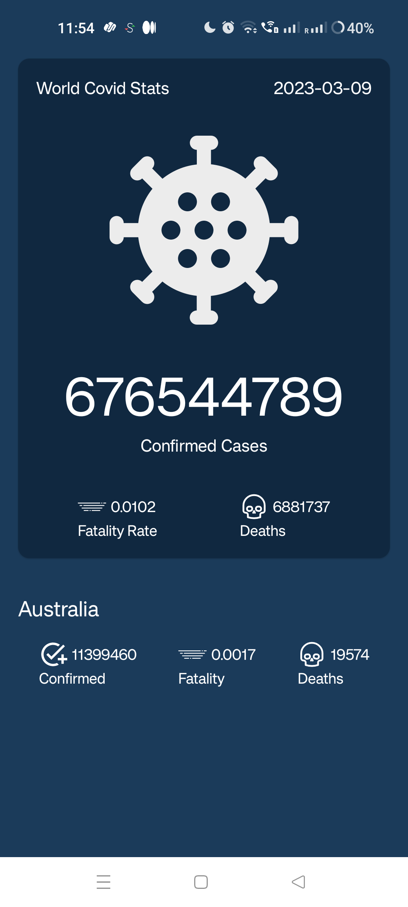

# Demo Android Application - Kotlin MVI Covid App with Jetpack Compose

Welcome to the Demo Android Application built with **Kotlin** and following the **MVI** architecture! This app utilizes the **https://covid-api.com/ API** to fetch reports worldwide and region specific

## Features:

1. **Worldwide report:**
   - Users can see the worldwide covid report confirmed cases, deaths and fatality rate.

2. **Region Specific Report:**
   - The application dynamically shows report for the country Australia by default.

## Technology Stack:

- **Kotlin:** The modern and expressive programming language for Android development.
  
- **Jetpack Compose:** Toolkit for building native UIs for Android apps in a declarative way.

- **MVI Clean Architecture:** Model-View-Intent. MVI is an architectural pattern that facilitates a reactive and unidirectional data flow within an application, promoting clean and maintainable code.

- **https://covid-api.com/ API:** Seamless integration with the API for real-time and up-to-date data.

- **Other libraries used:** Coroutines, Dependency Injection (Hilt), Retrofit

## Screenshots:

  

